## Результаты лабораторной работы №10

### Спектрограммы (Задание 2)

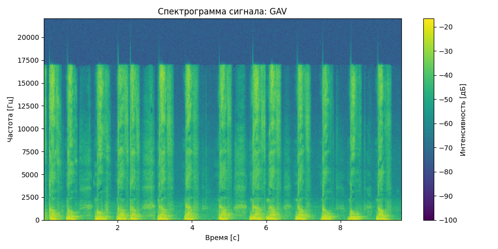
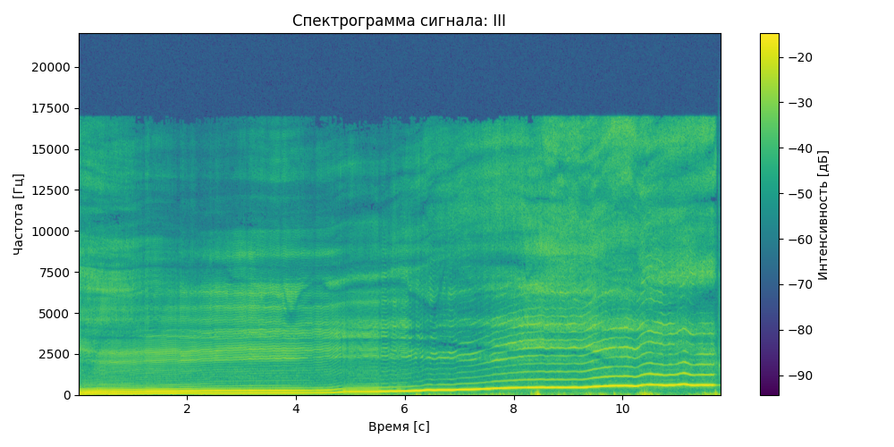

---

### Минимальная и максимальная частота (Задание 3)
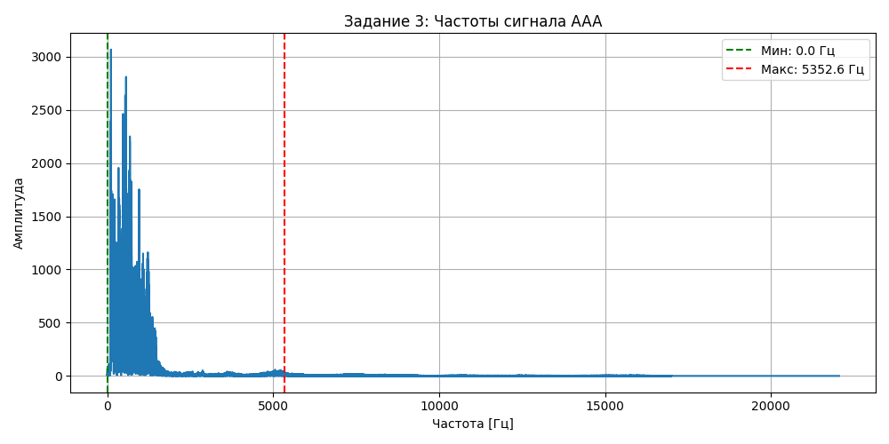
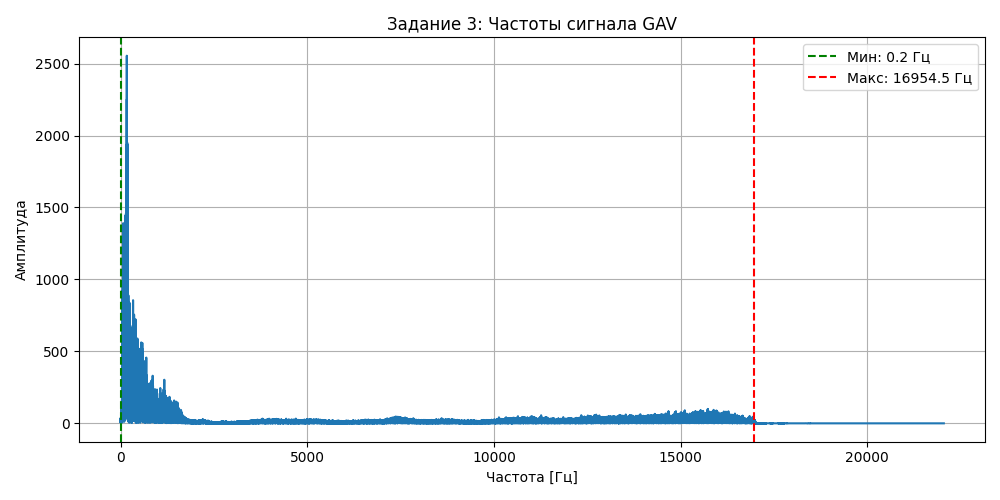
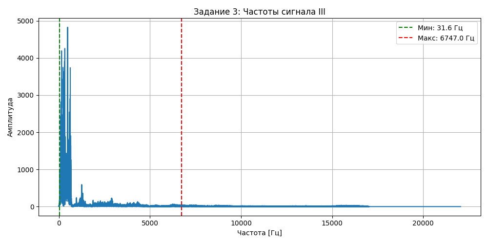

---

### Обертоны (Задание 4)
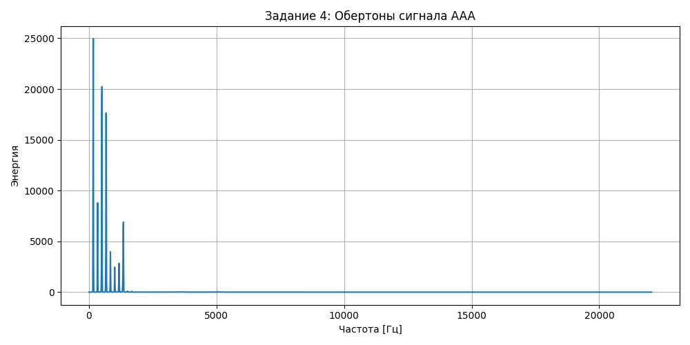
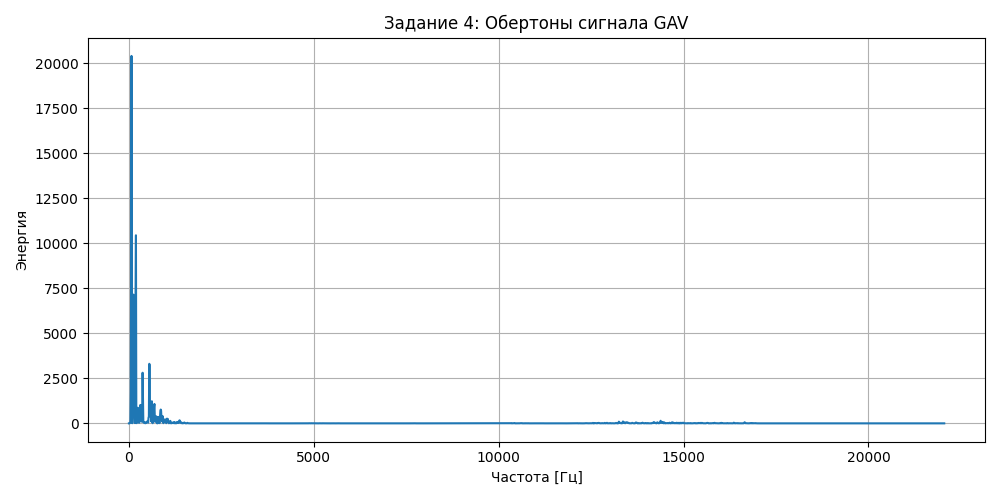
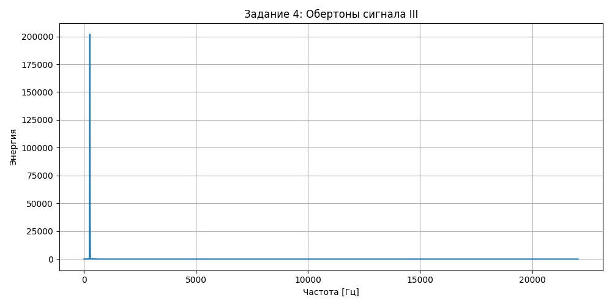

---

### Форманты (Задание 5)
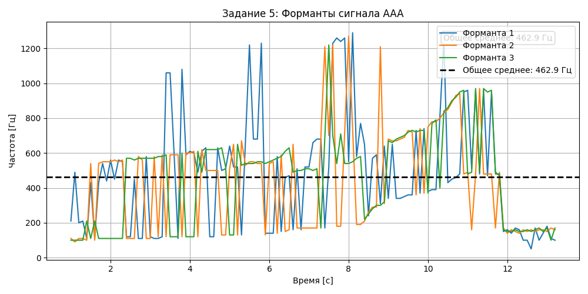

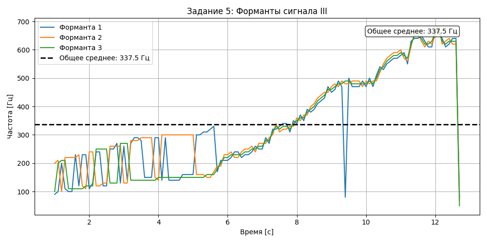

---

### Суммарная форманта (Задание 5.1)
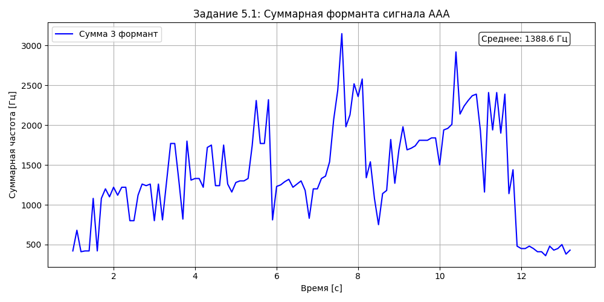
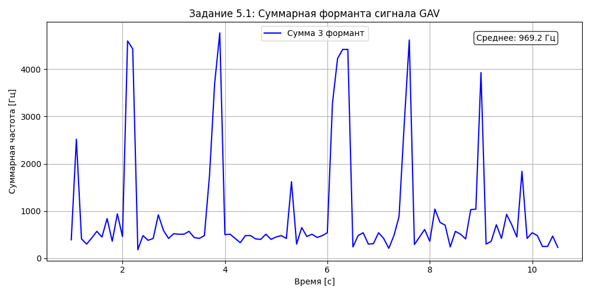

