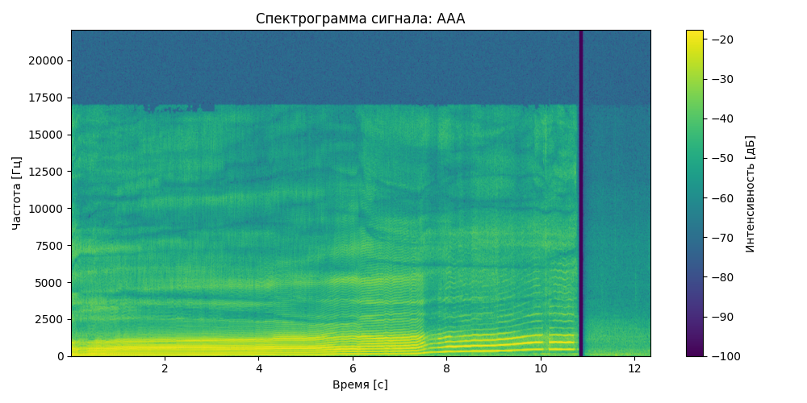
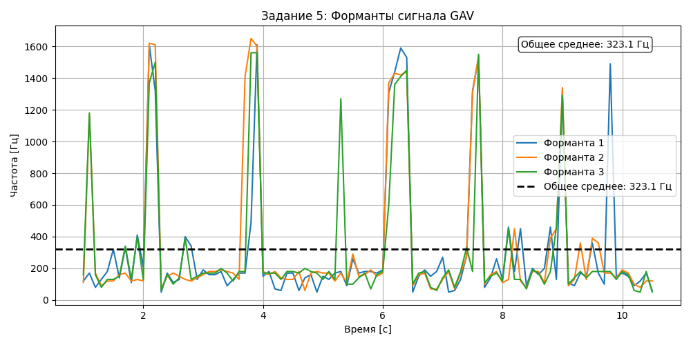
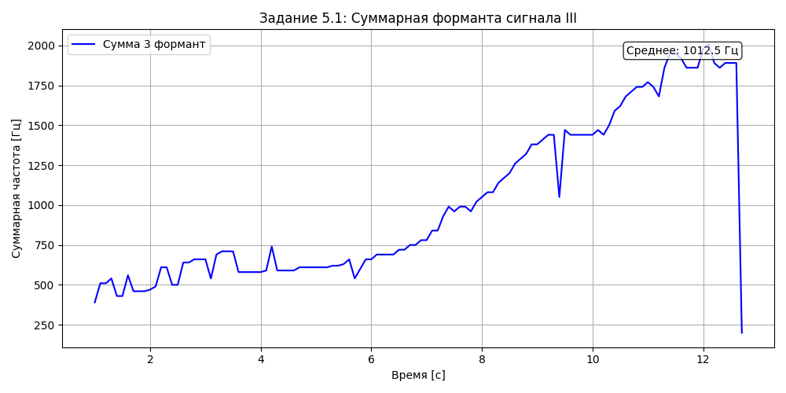

## Результаты лабораторной работы №10

### Спектрограммы (Задание 2)

---

### Минимальная и максимальная частота (Задание 3)

---

### Обертоны (Задание 4)

---

### Форманты (Задание 5)

---

### Суммарная форманта (Задание 5.1)

