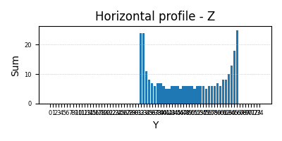
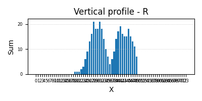

## Лабораторная работа №5. Выделение признаков символов  
## Латинские заглавные буквы  
  
  
  
  
  
  
  
  
  
  
  
  
  
  
  
  
  
  
  
  
  
  
  
  
  

| char | q1_abs | q2_abs | q3_abs | q4_abs | q1_rel | q2_rel | q3_rel | q4_rel | center_x | center_y | center_x_rel | center_y_rel | ix       | iy       | ix_rel   | iy_rel   |
|------|--------|--------|--------|--------|--------|--------|--------|--------|-----------|-----------|---------------|---------------|----------|----------|----------|----------|
| A    | 0      | 21     | 69     | 154    | 0.0    | 0.0149 | 0.0491 | 0.1095 | 38.11     | 52.23     | 0.5015        | 0.6831        | 23767.68 | 12184.01 | 0.000732 | 0.000375 |
| B    | 27     | 26     | 148    | 151    | 0.0197 | 0.019  | 0.1081 | 0.1103 | 36.72     | 49.4      | 0.4893        | 0.654         | 39160.32 | 21753.16 | 0.001271 | 0.000706 |
| C    | 18     | 38     | 148    | 21     | 0.0125 | 0.0263 | 0.1025 | 0.0145 | 33.85     | 48.24     | 0.4323        | 0.6216        | 29761.04 | 20842.16 | 0.000847 | 0.000593 |
| D    | 33     | 23     | 154    | 142    | 0.0223 | 0.0155 | 0.1041 | 0.0959 | 39.37     | 49.24     | 0.4857        | 0.6519        | 39518.47 | 42900.25 | 0.001098 | 0.001192 |
| E    | 27     | 28     | 157    | 61     | 0.0197 | 0.0205 | 0.1147 | 0.0446 | 34.25     | 49.86     | 0.4493        | 0.6603        | 37103.99 | 15837.06 | 0.001173 | 0.000501 |
| F    | 30     | 29     | 158    | 31     | 0.0213 | 0.0206 | 0.1124 | 0.022  | 33.42     | 47.41     | 0.4266        | 0.6271        | 29781.87 | 15292.39 | 0.000893 | 0.000459 |
| G    | 21     | 37     | 148    | 103    | 0.0142 | 0.025  | 0.0999 | 0.0695 | 37.85     | 50.19     | 0.4786        | 0.6473        | 35694.35 | 34807.15 | 0.000990 | 0.000965 |
| H    | 37     | 38     | 173    | 159    | 0.0238 | 0.0245 | 0.1113 | 0.1023 | 39.86     | 48.87     | 0.4626        | 0.6469        | 48054.84 | 45021.02 | 0.001182 | 0.001108 |
| I    | 5      | 30     | 120    | 29     | 0.0042 | 0.0253 | 0.1014 | 0.0245 | 29.72     | 49.18     | 0.4558        | 0.6511        | 23649.72 | 2505.30  | 0.001026 | 0.000109 |
| J    | 0      | 42     | 88     | 83     | 0.0    | 0.0316 | 0.0662 | 0.0624 | 33.58     | 50.46     | 0.4655        | 0.6595        | 27830.91 | 10981.81 | 0.000956 | 0.000377 |
| K    | 36     | 32     | 209    | 86     | 0.0243 | 0.0216 | 0.1412 | 0.0581 | 35.83     | 49.92     | 0.4409        | 0.6611        | 46627.84 | 22855.41 | 0.001295 | 0.000635 |
| L    | 23     | 14     | 153    | 31     | 0.0178 | 0.0108 | 0.1181 | 0.0239 | 31.26     | 51.20     | 0.4323        | 0.6784        | 30207.24 | 6838.30  | 0.001065 | 0.000241 |
| M    | 31     | 33     | 209    | 188    | 0.0186 | 0.0198 | 0.1255 | 0.1129 | 43.68     | 49.33     | 0.4742        | 0.6531        | 49781.88 | 65732.13 | 0.001069 | 0.001411 |
| N    | 37     | 27     | 139    | 98     | 0.0237 | 0.0173 | 0.0892 | 0.0629 | 38.43     | 48.04     | 0.4621        | 0.6272        | 33158.44 | 23835.85 | 0.000854 | 0.000614 |
| O    | 18     | 38     | 152    | 140    | 0.0121 | 0.0256 | 0.1026 | 0.0945 | 39.67     | 49.19     | 0.5022        | 0.6340        | 35822.86 | 48010.66 | 0.000993 | 0.001331 |
| P    | 28     | 27     | 155    | 65     | 0.0205 | 0.0197 | 0.1132 | 0.0475 | 35.16     | 46.68     | 0.4616        | 0.6173        | 29923.84 | 20656.96 | 0.000946 | 0.000653 |
| Q    | 39     | 60     | 194    | 148    | 0.0233 | 0.0358 | 0.1157 | 0.0883 | 38.73     | 54.88     | 0.4901        | 0.6265        | 82282.14 | 54171.96 | 0.001787 | 0.001176 |
| R    | 31     | 27     | 152    | 148    | 0.0226 | 0.0197 | 0.1110 | 0.1081 | 36.06     | 49.27     | 0.4802        | 0.6523        | 41532.26 | 20560.88 | 0.001348 | 0.000668 |
| S    | 22     | 31     | 92     | 110    | 0.0170 | 0.0240 | 0.0712 | 0.0851 | 34.28     | 49.16     | 0.4894        | 0.6337        | 31737.08 | 11279.23 | 0.001124 | 0.000400 |
| T    | 22     | 46     | 122    | 39     | 0.0161 | 0.0336 | 0.0891 | 0.0285 | 35.85     | 46.59     | 0.4774        | 0.6161        | 31929.23 | 9447.65  | 0.001037 | 0.000307 |
| U    | 42     | 25     | 133    | 56     | 0.0270 | 0.0160 | 0.0854 | 0.0359 | 37.40     | 47.35     | 0.4439        | 0.6180        | 31770.36 | 28451.36 | 0.000798 | 0.000715 |
| V    | 37     | 29     | 137    | 26     | 0.0250 | 0.0196 | 0.0924 | 0.0175 | 35.55     | 45.83     | 0.4488        | 0.5977        | 23913.01 | 12328.57 | 0.000680 | 0.000351 |
| W    | 45     | 65     | 191    | 134    | 0.0263 | 0.0380 | 0.1117 | 0.0784 | 41.56     | 46.37     | 0.4557        | 0.6049        | 42877.15 | 44835.37 | 0.000916 | 0.000958 |
| X    | 35     | 28     | 167    | 60     | 0.0231 | 0.0185 | 0.1101 | 0.0396 | 37.56     | 48.93     | 0.4458        | 0.6478        | 39937.76 | 16855.72 | 0.001031 | 0.000435 |
| Y    | 35     | 28     | 138    | 39     | 0.0256 | 0.0205 | 0.1008 | 0.0285 | 35.90     | 46.72     | 0.4716        | 0.6178        | 30650.30 | 8142.40  | 0.000969 | 0.000257 |
| Z    | 24     | 33     | 139    | 91     | 0.0162 | 0.0223 | 0.0939 | 0.0615 | 36.26     | 48.76     | 0.4622        | 0.6395        | 31102.52 | 16227.84 | 0.001013 | 0.000529 |

## Горизонтальные профили

## Вертикальные профили

