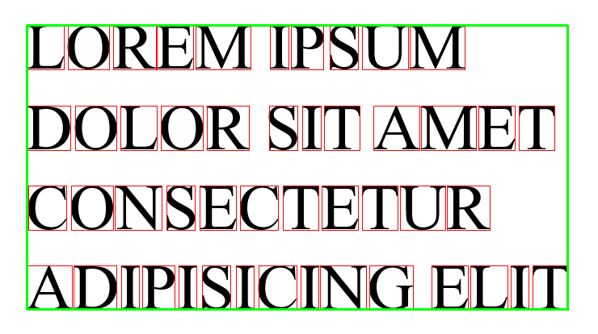

# Лабораторная работа №6  
## Сегментация текста

---

## Задание 1  
Подготовка изображения фразы и его бинаризация.

---

## Задание 2  
Построение горизонтального и вертикального профилей изображения.

**Горизонтальный профиль изображения:**  

**Вертикальный профиль изображения:**  

---

## Задание 3  
Сегментация символов на основе профилей с прореживанием. Обводка символов прямоугольниками.

**Сегментированное изображение с обводкой символов:**  

---

## Задание 4  
Построение горизонтального и вертикального профилей выбранного символа.

**Горизонтальный профиль символа:**  

**Вертикальный профиль символа:**  

---

## Задание 5  
Определение обрамляющего прямоугольника для всего текста.

**Обрамляющий прямоугольник для текста:**  

---

