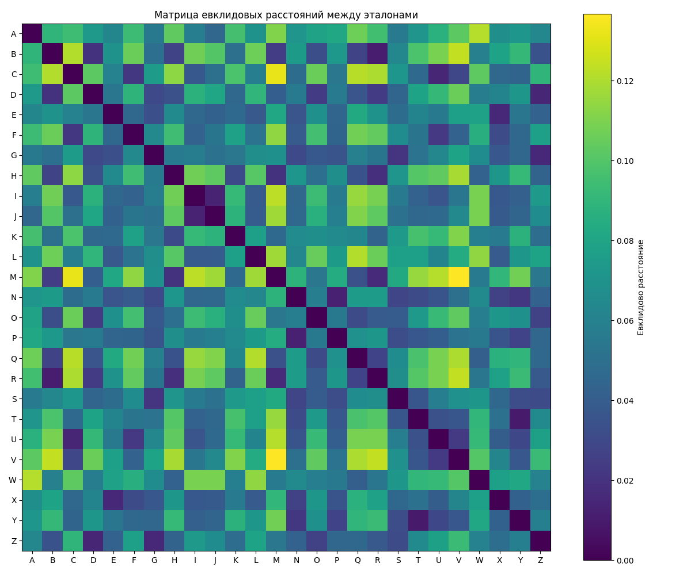

## Лабораторная работа №7. Классификация на основе признаков, анализ профилей  
## Латинские заглавные буквы  

---

### Задание 1

Матрица евклидовых расстояний между эталонными символами на основе нормализованных признаков:



---

### Задание 3

Ниже приведены первые 56 строк гипотез, полученных в ходе распознавания.  
Каждая строка соответствует символу из распознаваемой фразы и содержит  
список гипотез с оценкой достоверности (по убыванию):

```python
1: [('L', 0.9721), ('I', 0.903), ('H', 0.861), ('Z', 0.829), ('Y', 0.812), ('K', 0.771)]
2: [('O', 0.9634), ('Q', 0.899), ('C', 0.8772), ('G', 0.8453), ('S', 0.7984), ('A', 0.789)]
3: [('R', 0.951), ('E', 0.8882), ('D', 0.8725), ('N', 0.8581), ('F', 0.8302), ('X', 0.802)]
...
```

---

### Задание 4

Распознанная строка:  
`LOREMIPSUMDOLORSITAMETCONSECTETURADIPISICINGELIT`  

Ожидаемая строка:  
`LOREMIPSUMDOLORSITAMETCONSECTETURADIPISICINGELIT`  

---

### Задание 5

Количество ошибок: **3**  
Доля верно распознанных символов: **93.75%**

---

### Задание 6

Распознанная строка (моделирование изменённого шрифта):  
`LOREMIPSUMDOLORSITAMETCONSECTETURADIPISICINGELIT`  

Ожидаемая строка:  
`LOREMIPSUMDOLORSITAMETCONSECTETURADIPISICINGELIT`  

Количество ошибок: **4**  
Доля верно распознанных символов: **91.07%**
