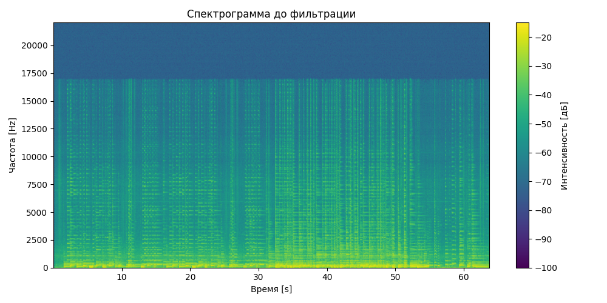
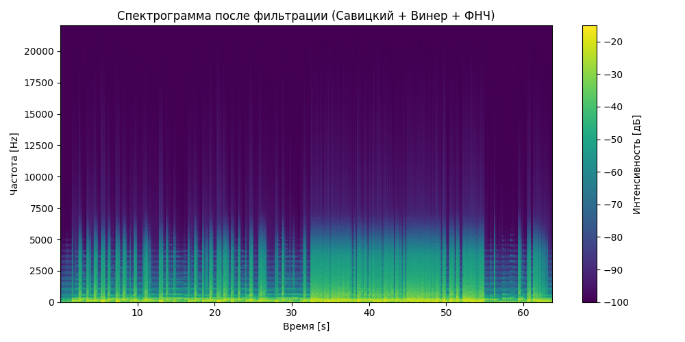
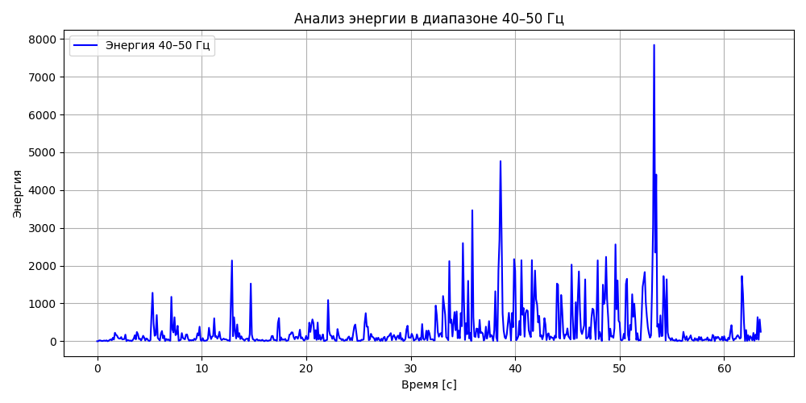

# Лабораторная работа №9

## 🎵 Аудиофайлы

### Оригинальный сигнал
<audio controls>
  <source src="guitar.wav" type="audio/wav">
  Your browser does not support the audio element.
</audio>

### Фильтрованный сигнал (Савицкий–Голей + Винер)
<audio controls>
  <source src="guitar_filtered_all.wav" type="audio/wav">
  Your browser does not support the audio element.
</audio>

## Спектрограммы

### До фильтрации

### После фильтрации

## Анализ энергии в диапазоне 40–50 Гц

